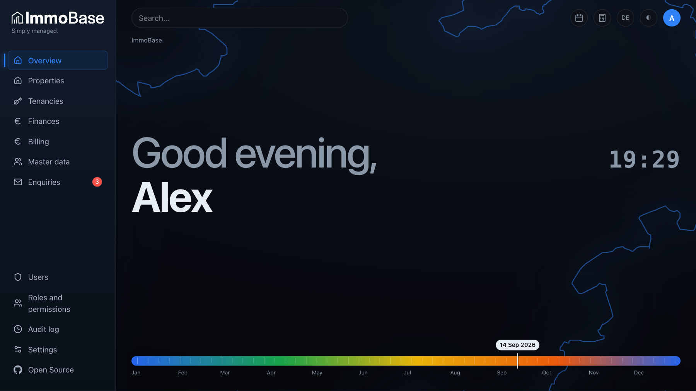
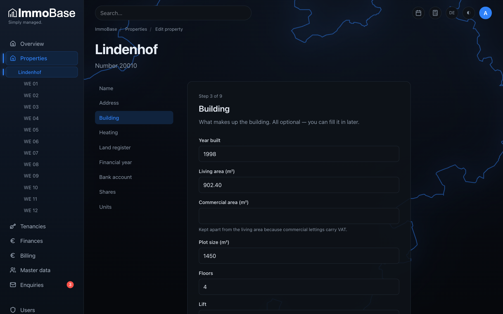
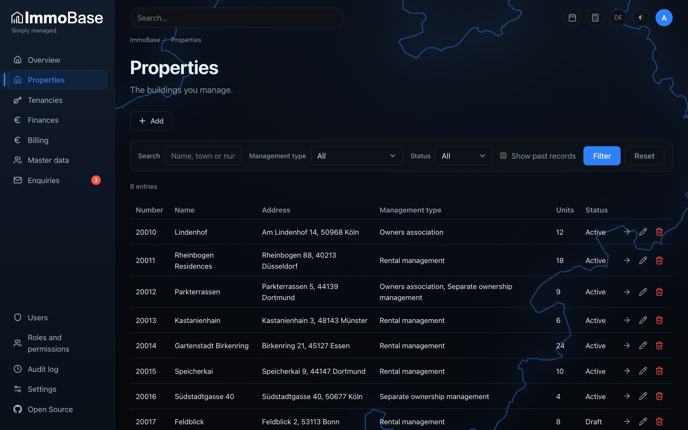
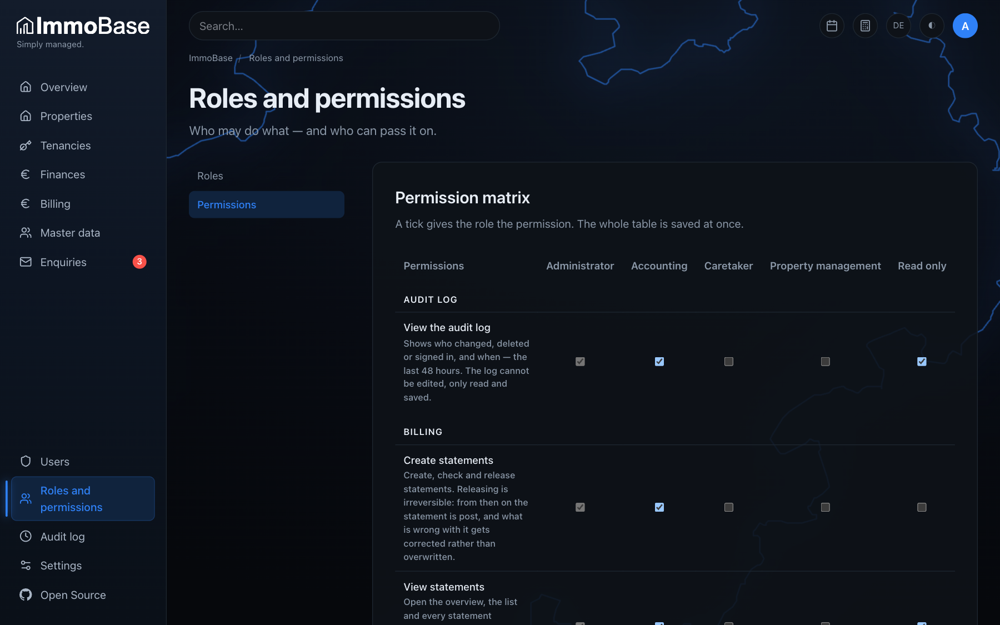

<h1 align="center">
  <picture>
    <source media="(prefers-color-scheme: dark)" srcset="assets/images/logo-on-dark.svg">
    
  </picture>
</h1>

<p align="center"><strong>Einfach. Verwalten.</strong></p>

<p align="center">
  Open-Source-Hausverwaltungssoftware für WEG-Verwaltung, Mietverwaltung und Sondereigentumsverwaltung — selbst gehostet, mit einem Befehl installiert.<br>
  <em>Open source property management software for German landlords and property managers — self-hosted, installed with one command.</em>
</p>

<p align="center">
  <a href="LICENSE"></a>
  <a href="https://github.com/s3gv/immobase/actions/workflows/ci.yml"></a>
  <a href="https://github.com/s3gv/immobase/commits/main"></a>
  
  
  
  
  
  
  
  <a href="CONTRIBUTING.md"></a>
</p>

<p align="center">
  <a href="#deutsch">Deutsch</a> ·
  <a href="#english">English</a> ·
  <a href="#installation">Installation</a>
</p>

---

## Deutsch

### Was ist ImmoBase?

**ImmoBase ist eine freie Hausverwaltungssoftware für den deutschen Markt.** Sie
bildet die tägliche Arbeit einer Hausverwaltung ab: Objekte und Einheiten,
Eigentümer und Mieter, Mietverhältnisse, Kosten und Vorauszahlungen, die
**Betriebskostenabrechnung**, die **Hausgeldabrechnung** mit Wirtschaftsplan und
Vermögensbericht nach § 28 WEG, das Mahnwesen und ein Portal für Mieter und
Eigentümer.

ImmoBase läuft auf dem eigenen Server oder Rechner, nicht in einer fremden
Cloud. Eine Installation gehört genau einer Verwaltung. Es gibt keinen
Lizenzserver, kein Konto bei einem Anbieter und keine monatliche Gebühr. Der
Quellcode steht unter der **AGPLv3**.

**Für wen:** private Vermieter mit mehreren Objekten, kleine und mittlere
Hausverwaltungen, WEG-Verwalter und Verwalter von Sondereigentum.

**Installation:** drei Befehle auf einem Server mit Docker — die Anleitung steht
[unten auf Englisch](#installation).

### Funktionen

**Objekte und Menschen**

- **Objekte und Einheiten** mit Flächen, Miteigentumsanteilen (MEA), Gebäude-
  und Heizungsdaten, Grundbuch und Hausgeld- bzw. Mietkonto.
- **Stammdaten** für Mieter, Eigentümer und weitere Kontakte, Personen wie Firmen.
- **Mietverhältnisse** mit Laufzeit, Mietstaffel, Kaution, Haushaltsgröße und
  Umsatzsteuer-Option für Gewerbe.
- **Eigentümerwechsel und Mieterwechsel tagesgenau**, auch mitten im Jahr.

**Finanzen und Abrechnung**

- **Kosten**, **Vorauszahlungen**, **Verteilerschlüssel** (Fläche, MEA, Personen,
  Einheiten, Verbrauch, fest), **Erhaltungsrücklage** und **Darlehen** der Gemeinschaft.
- **Betriebskostenabrechnung** für Mieter mit nachvollziehbarem Rechenweg,
  Korrekturen und Umsatzsteuer.
- **Hausgeldabrechnung, Wirtschaftsplan, Budgetplanung und Vermögensbericht**
  (§ 28 Abs. 4 WEG) für Eigentümergemeinschaften.
- **Dauermietrechnung** für Gewerbemietverhältnisse.
- **E-Rechnung im Format XRechnung (CII)** für Dauermietrechnung und
  Betriebskostenabrechnung, geprüft gegen die amtlichen Schemata.
- **Mahnwesen**: Vorschläge aus offenen Forderungen, Mahnstufen, Verzugszinsen,
  Mahnschreiben als PDF und eine Übersicht für das gerichtliche Mahnverfahren.
- Alle Schreiben als **PDF** mit Briefkopf nach DIN 5008.

**Zusammenarbeit**

- **Mieter- und Eigentümerportal**: Anfragen mit verschlüsselten Anhängen,
  Änderungsvorschläge zu den eigenen Daten, Freigabe durch die Verwaltung.
- **Benutzer, Rollen und Rechte (RBAC)**: jede Rolle bekommt genau die Rechte,
  die sie braucht, in einer übersichtlichen Rechtematrix.
- **Anmeldung mit zweitem Faktor** (Authenticator-App oder E-Mail-Code) und
  Wiederherstellungscodes.
- **Änderungsprotokoll**: wer wann was geändert hat.
- **Übersicht** mit Aufgaben und Kennzahlen, **zentrale Suche**, Erinnerungen und
  ein Taschenrechner in der Kopfzeile.
- **Zweisprachig**: Deutsch und Englisch.
- **Plugins** über eine HTTP-Schnittstelle, getrennt vom Kern: jedes Plugin
  läuft als eigener Prozess unter eigener Benutzerkennung und hinter einer
  Netzsperre. Das mitgelieferte Auswertungs-Plugin zeigt, wie es geht.

**Geführte Abläufe statt überladener Formulare.** Wer ein Objekt, ein
Mietverhältnis oder eine Abrechnung anlegt, geht Schritt für Schritt vor, jeder
Schritt mit einer klaren Frage.

### Screenshots

<p align="center">
  <br>
  <sub>Die Übersicht direkt nach der Anmeldung — darunter folgen Aufgaben und Kennzahlen aus allen Modulen.</sub>
</p>

<p align="center">
  <br>
  <sub>Geführter Ablauf: ein Objekt in neun Schritten, hier das Gebäude.</sub>
</p>

<p align="center">
  <br>
  <sub>Übersicht der Objekte mit Suche und Filtern.</sub>
</p>

<p align="center">
  <br>
  <sub>Rollen und Rechte: die Rechtematrix.</sub>
</p>

<sub>Die Screenshots zeigen die englische Oberfläche im dunklen Design mit frei erfundenen Beispieldaten.</sub>

### Technik

- **PHP 8.4** und **Symfony 8.1**, modular aufgebaut mit festen Modulgrenzen
- **PostgreSQL 16**
- **FrankenPHP** (Caddy) als Webserver, **Docker Compose** für den Betrieb
- Oberfläche serverseitig mit Twig, Tailwind CSS und wenig JavaScript, **ohne
  Node im Build**
- Geldbeträge durchgehend als ganze Cent
- Sicherheit:
  - Content-Security-Policy
  - Rechteprüfung an jeder Route
  - gebremste Anmeldung
  - Container ohne root
  - Plugins in eigener Benutzerkennung hinter einer Netzsperre
- Qualität: PHPStan auf höchster Stufe, Architekturprüfung mit Deptrac,
  Komplexitätsgrenzen und mehr als 1.400 automatisierte Tests

Die Regeln für den Code stehen in [docs/conventions.md](docs/conventions.md), die
Architekturentscheidungen in [docs/architecture/decisions/](docs/architecture/decisions/).

### Häufige Fragen

**Ist ImmoBase kostenlos?**
Ja. ImmoBase ist Open Source unter der AGPLv3 und kostet keine Lizenzgebühr. Wer
ImmoBase verändert und anderen über ein Netzwerk zur Verfügung stellt, muss den
geänderten Quellcode ebenfalls offenlegen.

**Brauche ich einen Cloud-Anbieter?**
Nein. ImmoBase läuft auf jedem Server oder Rechner mit Docker, auch im eigenen
Büro. Die Daten verlassen die eigene Installation nicht.

**Kann ImmoBase eine Betriebskostenabrechnung und eine Hausgeldabrechnung
erstellen?**
Ja. Beide Abrechnungen entstehen aus den erfassten Kosten, Vorauszahlungen und
Verteilerschlüsseln, mit tagesgenauer Aufteilung bei Mieter- oder
Eigentümerwechsel und als PDF.

**Unterstützt ImmoBase die E-Rechnung?**
Ja, im Format XRechnung (CII) für Dauermietrechnungen und
Betriebskostenabrechnungen von Gewerbemietverhältnissen mit Umsatzsteuer.
Wohnraummiete und Hausgeld sind von der E-Rechnungspflicht ausgenommen.

**Ist ImmoBase eine Finanzbuchhaltung?**
Nein. ImmoBase verwaltet Objekte, Mietverhältnisse, Kosten und Abrechnungen,
ersetzt aber keine doppelte Buchführung und importiert keine Kontoauszüge.

**Ist ImmoBase schon produktiv einsetzbar?**
Ja. Version 1.0 enthält alle Funktionen oben, abgesichert durch mehr als 1.400
automatisierte Tests, die bei jeder Änderung laufen. Die Plugin-Schnittstelle
v1 bleibt innerhalb von 1.x stabil.

### Lizenz und Mitwirken

ImmoBase steht unter der **GNU Affero General Public License v3.0 oder später**,
siehe [LICENSE](LICENSE). Beiträge sind willkommen. Vor dem ersten Pull Request
bitte [CONTRIBUTING.md](CONTRIBUTING.md) lesen: Beiträge setzen eine
Contributor License Agreement voraus, die den Maintainer verpflichtet, jeden
Beitrag weiter unter der AGPLv3 anzubieten.

- [Verhaltenskodex](CODE_OF_CONDUCT.md)
- [Sicherheitslücken melden](SECURITY.md)
- [Plugin-Schnittstelle](docs/architecture/plugin-boundary.md)

---

## English

### What is ImmoBase?

**ImmoBase is free, open source property management software for the German
market.** It covers the daily work of a property manager: properties and units,
owners and tenants, tenancies, costs and advance payments, the **operating cost
statement** (Betriebskostenabrechnung), the **owners' association statement**
(Hausgeldabrechnung) with business plan and asset report under § 28 WEG,
dunning, and a portal for tenants and owners.

ImmoBase runs on your own server or computer, not in someone else's cloud. One
installation belongs to exactly one management company. There is no license
server, no vendor account and no monthly fee. The source code is licensed under
the **AGPLv3**.

**Who it is for:** private landlords with several buildings, small and
mid-sized property management companies, managers of owners' associations (WEG)
and of individual condominium units (Sondereigentum).

**Installation:** three commands on a server with Docker — see
[Installation](#installation) below.

### Features

**Properties and people**

- **Properties and units** with floor areas, co-ownership shares (MEA), building
  and heating data, land register and bank accounts.
- **Master data** for tenants, owners and other contacts, people and companies
  alike.
- **Tenancies** with term, staggered rent, deposit, household size and the VAT
  option for commercial lettings.
- **Changes of owner or tenant to the exact day**, even in the middle of the
  year.

**Finances and billing**

- **Costs**, **advance payments**, **distribution keys** (area, MEA, persons,
  units, metered, fixed), **maintenance reserve** and **loans** of the association.
- **Operating cost statements** for tenants with a traceable calculation,
  corrections and VAT.
- **Owners' association statements, business plans, budget plans and asset
  reports** (§ 28(4) WEG).
- **Standing rent invoices** for commercial tenancies.
- **E-invoicing in XRechnung (CII) format** for standing rent invoices and
  operating cost statements, validated against the official schemas.
- **Dunning**: suggestions from open claims, dunning levels, default interest,
  dunning letters as PDF and a summary for court proceedings.
- All letters as **PDF** with a DIN 5008 letterhead.

**Working together**

- **Tenant and owner portal**: enquiries with encrypted attachments, proposed
  changes to one's own data, approval by the management.
- **Users, roles and permissions (RBAC)**: every role gets exactly the rights it
  needs, in one clear permission matrix.
- **Two-factor sign-in** (authenticator app or email code) with recovery codes.
- **Audit log**: who changed what, and when.
- **Dashboard** with to-dos and key figures, **global search**, reminders and a
  calculator in the header.
- **Bilingual**: German and English.
- **Plugins** through an HTTP API, separated from the core. Every plugin runs as
  its own process under its own user ID and behind a network lock. The bundled
  reports plugin shows how it works.

**Guided workflows instead of overloaded forms.** Creating a property, a
tenancy or a statement happens step by step, each step asking one clear
question.

### Screenshots

<p align="center">
  <br>
  <sub>The dashboard right after sign-in — to-dos and key figures from every module follow below.</sub>
</p>

<p align="center">
  <br>
  <sub>Guided workflow: a property in nine steps, here the building.</sub>
</p>

<p align="center">
  <br>
  <sub>Property overview with search and filters.</sub>
</p>

<p align="center">
  <br>
  <sub>Roles and permissions: the permission matrix.</sub>
</p>

<sub>The screenshots show the English interface in the dark theme with entirely fictional sample data.</sub>

### Technology

- **PHP 8.4** and **Symfony 8.1**, modular with enforced module boundaries
- **PostgreSQL 16**
- **FrankenPHP** (Caddy) as web server, **Docker Compose** for operation
- Server-rendered interface with Twig, Tailwind CSS and little JavaScript, **no
  Node in the build**
- Money as integer cents throughout
- Security:
  - Content Security Policy
  - permission checks on every route
  - throttled sign-in
  - non-root containers
  - plugins under their own user ID behind a network lock
- Quality: PHPStan at the highest level, architecture checks with Deptrac,
  complexity limits and more than 1,400 automated tests

Code conventions are in [docs/conventions.md](docs/conventions.md), architecture
decisions in [docs/architecture/decisions/](docs/architecture/decisions/)
(both in German).

### FAQ

**Is ImmoBase free?**
Yes. ImmoBase is open source under the AGPLv3 and has no license fee. If you
modify ImmoBase and make it available to others over a network, you must
publish your modified source code as well.

**Do I need a cloud provider?**
No. ImmoBase runs on any server or computer with Docker, including one in your
own office. Your data never leaves your installation.

**Can ImmoBase create operating cost statements and owners' association
statements?**
Yes. Both are generated from the recorded costs, advance payments and
distribution keys, split to the exact day when a tenant or owner changes, and
delivered as PDF.

**Does ImmoBase support e-invoicing?**
Yes, in XRechnung (CII) format for standing rent invoices and operating cost
statements of commercial tenancies with VAT. Residential rent and owners'
association fees are exempt from the German e-invoicing mandate.

**Is ImmoBase an accounting system?**
No. ImmoBase manages properties, tenancies, costs and statements, but it does
not replace double-entry bookkeeping and does not import bank statements.

**Is ImmoBase ready for production use?**
Yes. Version 1.0 includes every feature listed above, backed by more than 1,400
automated tests that run on every change. The plugin API v1 stays stable
throughout 1.x.

### License and contributing

ImmoBase is licensed under the **GNU Affero General Public License v3.0 or
later**, see [LICENSE](LICENSE). Contributions are welcome. Please read
[CONTRIBUTING.md](CONTRIBUTING.md) before your first pull request: contributions
require a Contributor License Agreement, which binds the maintainer to keep
offering every contribution under the AGPLv3.

- [Code of Conduct](CODE_OF_CONDUCT.md)
- [Security policy](SECURITY.md)
- [Plugin API](docs/architecture/plugin-boundary.md) (in German)

---

## Installation

### Requirements

- A Linux server or a computer with Docker (Docker Engine or Docker Desktop)
  including Docker Compose v2
- `git` and `openssl`
- For HTTPS with Let's Encrypt: your own domain pointing to the server, and
  ports 80 and 443

### Three commands

```bash
git clone https://github.com/s3gv/immobase.git
cd immobase
./install.sh
```

The installer asks for everything it needs and suggests sensible defaults.
Optional answers can be skipped with Enter. It asks for:

1. **Access**:
   - on your own network over http,
   - through your own domain with an **automatic HTTPS certificate from Let's
     Encrypt**, or
   - behind an existing reverse proxy.
2. Interface language (German or English) and time zone.
3. The **first administrator account**.
4. Optionally a **mail server (SMTP)** for invitations and notifications.

It then generates all keys and passwords and builds the application. It starts
the services and waits until ImmoBase is ready. The database is set up
automatically on start. ImmoBase comes back up on its own after a server
restart.

```bash
docker compose --env-file .env.local up -d     # start
docker compose --env-file .env.local down      # stop
```

### Updating

```bash
git pull
docker compose --env-file .env.local up -d --build
```

The database is migrated to the new version on start.
